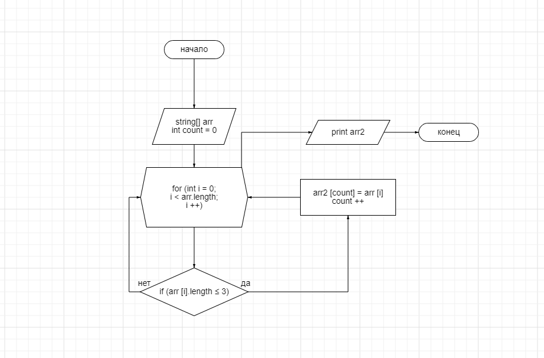

# Итоговая проверочная работа.
## Основные задачи

1. Создать репозиторий на GitHub.
2. Нарисовать блок-схему алгоритма (можно обойтись блок-схемой основной содержательной части, если вы выделяете её в отдельный метод)
3. Снабдить репозиторий оформленным текстовым описанием решения (файл README.md)
4. Написать программу, решающую поставленную задачу
5. Использовать контроль версий в работе над этим небольшим проектом (не должно быть так что все залито одним коммитом, как минимум этапы 2, 3 и 4 должны быть расположены в разных коммитах)

**Задача:** Написать программу, которая из имеющегося массива строк формирует массив из строк, длина которых меньше либо равна 3 символа. Первоначальный массив можно ввести с клавиатуры, либо задать на старте выполнения алгоритма. При решении не рекомендуется пользоваться коллекциями, лучше обойтись исключительно массивами.

**Пример:**

["hello", "2", "world", ":-)"] -> ["2", ":-)"] 

["1234", "1567", "-2", "computer science"] -> ["-2"]

["Russia", "Denmark", "Kazan"] -> []

## Решение

1. Ссылка на репозиторий на GitHub: https://github.com/Mavik01/Final_task_1quarter
2. Блок схема алгоритма 
3. **Алгоритм решения:** Сначала пользователь вводит данные через пробел. Полученную строку данных, мы преобразовываем в массив строк. Затем создаем новый массив, в который записываем только элементы первого массива с количеством символов не больше трех. Печатаем полученный массив.

